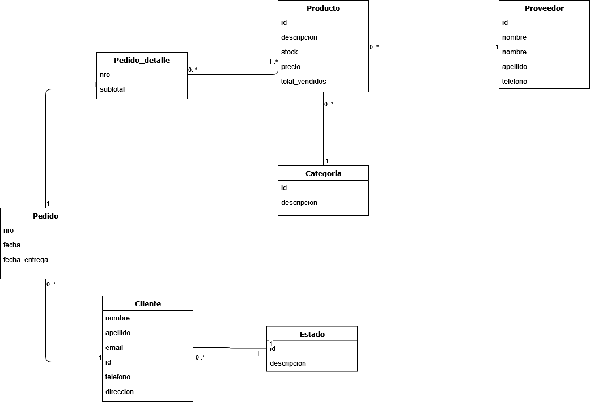

# SOFTWARE DE INVENTARIO WEB

## DESCRIPCION DEL PROYECTO
El proyecto es una aplicación web que consiste en la gestión de inventario. Se podrá gestionar la entrada y salida de productos, clientes, proveedores, generar pedidos, ver detalle de los pedidos, etc. Tambien será posible visualizar listas de productos mas vendidos, mejores clientes, distintos tipos de reportes y demás.

La  aplicación será desarrollada con Java 16 con Spring y MySQL.

## MODELO DE DOMINIO

## BOSQUEJO DE ARQUITECTURA

## REGLAS DE NEGOCIO

|  RN   | Descripción                                                                 |
| :---: | :-------------------------------------------------------------------------- |
|  01   | Validar stock de un producto antes de agregarlo a un pedido                 |
|  02   | Los usuarios pueden ser Administrador, Vendedor, Depósito(?), Transportista |
|  03   | Cada producto debe estar en una categoria                                   |
|  04   | Cada producto pertenece a un proveedor                                      |

## REQUERIMIENTOS

### FUNCIONALES

|  REQ  | Descripción                               | Implementado |
| :---: | :---------------------------------------- | :----------: |
|  01   | Crud productos                            |      ✓       |
|  02   | Crud proveedores                          |      ✓       |
|  03   | Crud categorias                           |      ✓       |
|  05   | Generar pedidos                           |      ✓       |
|  04   | Crud clientes                             |      ✓       |
|  06   | Añadir productos a un pedido              |      ✓       |
|  07   | Mostrar listado de productos mas vendidos |      ✓       |
|  08   | Mostrar listado de mejores clientes       |      ✗       |
|  09   | Mostrar detalle de un pedido              |      ✓       |
|  10   | Mostrar pedidos de un cliente             |      ✓       |
|  11   | Crud de usuarios                          |      ✗       |
|  12   | Asignar roles a usuarios                  |      ✗       |
|  12   | Gestionar ingresos de productos           |      ✗       |

### NO FUNCIONALES

Listado y descripción breve de los requerimientos no funcionales

#### Portability

- El sistema debe funcionar correctamente en múltiples navegadores.

#### Security

- Todas las contraseñas deben guardarse con encriptado criptográfico (SHA o equivalente).
- Todas los Tokens / API Keys o similares no deben exponerse de manera pública.

#### Maintainability

- El sistema debe diseñarse con la arquitectura en 3 capas.
- El sistema debe utilizar control de versiones mediante GIT.
- El sistema debe estar programado en Java 16.

#### Scalability

- El sistema debe funcionar desde una ventana normal y una de incógnito de manera independiente.
  - Aclaración: No se debe guardar el usuario en una variable local, deben usarse Tokens,Cookies o similares.

#### Performance

- El sistema debe funcionar en un equipo hogareño estándar.

#### Flexibility

- El sistema debe utilizar una base de datos SQL o NoSQL

## STACK TECNOLOGICO

Definir que tecnologías se van a utilizar en cada capa y una breve descripción sobre por qué se escogió esa tecnologia.

### Capa de Datos

- MySQL 8.
- Hibernate.
- Spring JPA.

Se utilizó MySQL porque es el motor de base de datos que uso generalmente, junto con hibernate como ORM para aprender una nueva tecnología.

### Capa de Negocio

- Apache POI.

Se utilizó Apache POI para generar archivos xlsx de las tablas de la base de datos para poder exportarlas y que sea legible por cualquier persona. Posteriormente se exportaran este tipo de archivos y pdfs para la generacion de reportes.

### Capa de Presentacion

- Spring WEB.
- HTML5.
- Thymeleaf.
- BOOTSTRAP 5.

Se utilizó Spring WEB como el framework para la capa de presentación ya que facilita muchas cosas a la hora de escribir código y me sentí muy cómodo usandolo. Thymeleaf para mostrar datos en los archivos HTML y BOOTSTRAP para darle estilo a las paginas. 